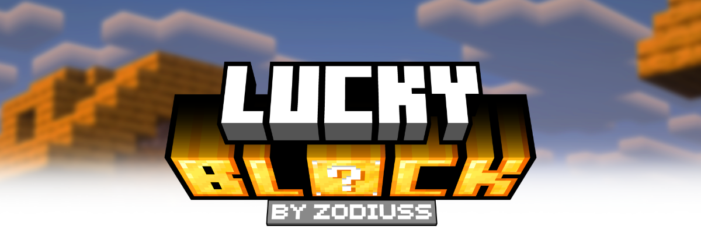
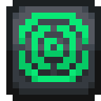
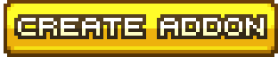

 

 

Lucky Blocks are magical boxes that give **random** drops upon being broken, ranging from huge explosions to harmless items to overpowered goods.

This core mod serves to recreate the original [Lucky Block Mod by Alex Socha](https://github.com/alexsocha/luckyblock), containing many similar drops and experiences. Despite the similarities, this mod is **not** affiliated with the original Lucky Block Mod. This mod exists because modern support for the old mod is practically non-existent.

 

- Wishing wells (explosions, potatoes, ores)
- Animals (jeb_ sheep, wolves, cats)
- Villagers with custom trades
- Traps (anvil, lava, water)
- Hero items (OP gear)
- _And many, many more_

_This mod implements over 100 drops_

 

Like the older Lucky Block Mod, this one supports addons, which add in their own custom types of Lucky Blocks.

These addons are provided via a _.zip_ file, and are placed within the
``
.minecraft/addons
``
folder of the game (which you will have to create yourself).